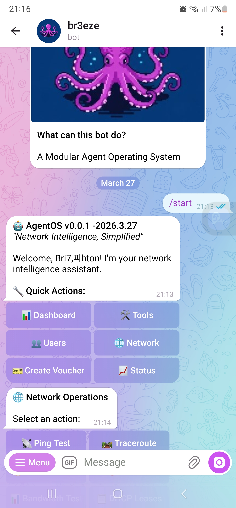
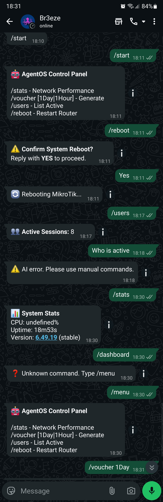

# 🤖 AgentOS — Network Intelligence Platform
<p align="center">
  
  
  
</p>
<h1 align="center">🤖 AgentOS</h1>
<p align="center"><strong>Network Intelligence Platform — AI-powered MikroTik management via Telegram, WhatsApp & CLI</strong></p>
<p align="center">
  <a href="#features">Features</a> •
  <a href="#quick-start">Quick Start</a> •
  <a href="#documentation">Docs</a> •
  <a href="#demo">Demo</a> •
  <a href="#contributing">Contributing</a>
</p>

---
## ✨ Why AgentOS?

Managing MikroTik routers shouldn't require memorizing CLI commands or keeping WinBox open 24/7. AgentOS brings **conversational AI** to network administration — control your infrastructure through natural language on your favorite messaging platform.

### The Problem
Traditional: Open WinBox → Navigate to IP → Hotspot → Active → Find User → Click Kick
AgentOS:    Send "kick john" in Telegram → Done in 2 seconds

---

## 🚀 Features

<table>
<tr>
<td width="50%">

### 🤖 AI Coordinator
- Natural language router management
- Gemini 2.5 ReAct reasoning engine
- Context-aware command suggestions

### 💬 Multi-Channel Control
- **Telegram Bot** — Rich inline keyboards
- **WhatsApp** — Baileys-powered messaging
- **WebSocket CLI** — Terminal-like experience in browser
- **REST API** — Programmatic access

</td>
<td width="50%">

### 🎫 Voucher System
- Automated WiFi access codes
- **Mastercard A2A** payment integration
- QR code generation
- Wallet-based voucher storage

### 🌐 Enterprise Ready
- Multi-router mesh management
- Real-time monitoring & alerts
- Audit trails & rate limiting
- CVE-2026-1526 security patched

</td>
</tr>
</table>

---

## 📦 Installation

```bash
# Clone repository
git clone https://github.com/br3eze-code/br3ezeclaw.git
cd br3ezeclaw

# Install dependencies
npm install

# Interactive setup
npm run onboard

# Or manual configuration
cp .env.example .env
# Edit .env with your MikroTik credentials
```
🎮 Quick Start
CLI Mode
```
# Start interactive CLI
npm start

# Or run specific commands
agentos status                    # Quick overview
agentos network ping 8.8.8.8      # Ping test
agentos users kick john          # Disconnect user
agentos voucher create 1Day      # Generate voucher
```
Daemon Mode (with Telegram/WhatsApp)
```
# Start gateway
agentos gateway --daemon

# Check status
agentos gateway:status

# View logs
tail -f logs/agentos.log
```
## 📸 Screenshots
<p align="center">
  
  <br>
  <em>Interactive CLI with real-time router feedback</em>
</p>
<p align="center">
  
  &nbsp;&nbsp;
  
  <br>
  <em>Unified messaging interface</em>
</p>

> **AI-powered MikroTik management with multi-channel control via Telegram, WhatsApp, and WebSocket CLI**

[](...)
[](LICENSE)


## ✨ Features

- 🔥 **AI Coordinator** — Gemini 2.5 ReAct engine for natural language router management
- 💬 **Unified Messaging** — Control via Telegram, WhatsApp, or WebSocket CLI
- 🎫 **Voucher System** — Automated WiFi access codes with Mastercard A2A payments
- 🌐 **Multi-Router Mesh** — Manage multiple MikroTik nodes from one interface
- 📊 **Real-time Monitoring** — System stats, alerts, and financial reporting
- 🔒 **Enterprise Security** — CVE-2026-1526 patched, rate-limited, audit trails

 ```bash
# 1. Clone
git clone https://github.com/br3eze-code/br3ezeclaw.git
cd br3ezeclaw

# 2. Install
npm install

# 3. Configure
cp .env.example .env
# Edit .env with your MikroTik credentials

# 4. Start
npm run dev        # Daemon mode
npm run cli        # Interactive CLI
```
## 📖 Documentation

-Installation Guide
-API Reference
-Telegram Bot Setup
-WhatsApp Integration

## 🛠️ Tech Stack
| Component  | Technology                            |
| ---------- | ------------------------------------- |
| Router API | MikroTik RouterOS API                 |
| AI Engine  | Google Gemini 2.5 Flash               |
| Messaging  | Telegram Bot API + Baileys (WhatsApp) |
| Payments   | Mastercard A2A                        |
| Database   | Firebase / Local JSON                 |
| Gateway    | WebSocket + Express                   |

🏗️ Architecture
```bash

┌─────────────────────────────────────────────────────────────┐
│                    🤖 AgentOS Gateway                       │
│                  (WebSocket + HTTP API)                     │
├─────────────────────────────────────────────────────────────┤
│  ┌─────────────┐  ┌─────────────┐  ┌─────────────────────┐  │
│  │  Telegram   │  │  WebSocket  │  │   HTTP REST API     │  │
│  │    Channel  │  │   Clients   │  │   (Vouchers/Tools)  │  │
│  │  (Buttons)  │  │  (Dashboard)│  │                     │  │
│  └──────┬──────┘  └──────┬──────┘  └──────────┬──────────┘  │
│         │                │                    │             │
│         └────────────────┴────────────────────┘             │
│                          │                                  │
│                   ┌──────▼──────┐                           │
│                   │   Core      │                           │
│                   │   Engine    │                           │
│                   └──────┬──────┘                           │
│                          │                                  │
│         ┌────────────────┼────────────────┐                 │
│         │                │                │                 │
│    ┌────▼────┐    ┌─────▼─────┐    ┌────▼────┐              │
│    │Hotspot  │    │ Database  │    │ Logger  │              │
│    │ Agent   │    │(Firebase/ │    │(Winston)│              │
│    │ (Tools) │    │  Local)   │    │         │              │
│    └────┬────┘    └───────────┘    └─────────┘              │
│         │                                                   │
│    ┌────▼─────────────────────────────────────────┐         │
│    │           🔧 Available Tools                 │         │
│    │  user.add | user.kick | user.status          │         │
│    │  users.active | system.stats | system.logs   │         │
│    │  ping | traceroute | firewall.list | reboot  │         │
│    └──────────────────────────────────────────────┘         │
└─────────────────────────────────────────────────────────────┘
                              │
                              ▼
                    ┌─────────────────┐
                    │  MikroTik Router │
                    │   (192.168.88.1) │
                    └─────────────────┘
```
## Folder Structure
```
agentos/
├── bin/
│   └── agentos.js              # CLI entry point
├── src/
│   ├── cli/
│   │   ├── program.js          # Commander setup
│   │   ├── commands/
│   │   │   ├── gateway.js      # agentos gateway (run|stop|status)
│   │   │   ├── network.js      # agentos network (ping|scan|firewall)
│   │   │   ├── users.js        # agentos users (list|kick|add)
│   │   │   ├── voucher.js      # agentos voucher (create|list|revoke)
│   │   │   ├── onboard.js      # agentos onboard (interactive setup)
│   │   │   ├── config.js       # agentos config (get|set)
│   │   │   └── doctor.js       # agentos doctor (health check)
│   │   └── hooks/
│   │       └── init.js         # Pre-command checks
│   ├── core/
│   │   ├── gateway.js          # WebSocket server
│   │   ├── mikrotik.js         # RouterOS manager
│   │   ├── database.js         # Firebase/local storage
│   │   └── logger.js           # Winston logger
│   └── utils/
│       ├── helpers.js          # Formatters, validators
│       └── config-manager.js   # Config file operations
├── package.json
└── README.md
```
## Command Line Interface Tree
```
agentos
├── onboard              Interactive setup wizard
├── gateway              Run WebSocket gateway
│   ├── (default)        Run in foreground
│   ├── --daemon         Run as service
│   └── --force          Kill existing process
├── gateway:status       Check if running
├── gateway:stop         Stop service
├── network (net)        Network tools
│   ├── ping <host>      Ping test
│   ├── scan             DHCP scan
│   ├── firewall         Show rules
│   ├── block <target>   Block address
│   └── unblock <target> Unblock address
├── users (user)         User management
│   ├── list             List users (--all for all)
│   ├── kick <user>      Disconnect user
│   ├── add <user>       Create user
│   ├── remove <user>    Delete user
│   └── status <user>    Check online status
├── voucher (v)          Voucher management
│   ├── create [plan]    Generate voucher
│   ├── list             Show recent
│   ├── revoke <code>    Delete unused
│   └── stats            Statistics
├── config               Configuration
│   ├── get <path>       Read value
│   ├── set <path>       Write value
│   ├── edit             Open in editor
│   └── show             Display all
├── doctor               Health check
│   └── --fix            Auto-repair
├── status (s)           Quick overview
├── --version            Show version
├── --help               Show help
├── --dev                Development profile
└── --profile <name>     Named profile
```
🤝 Contributing
See CONTRIBUTING.md
📜 License
MIT © [Brighton Mzacana]
